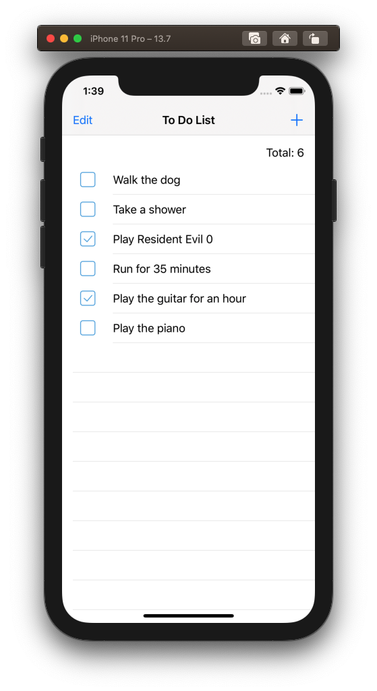
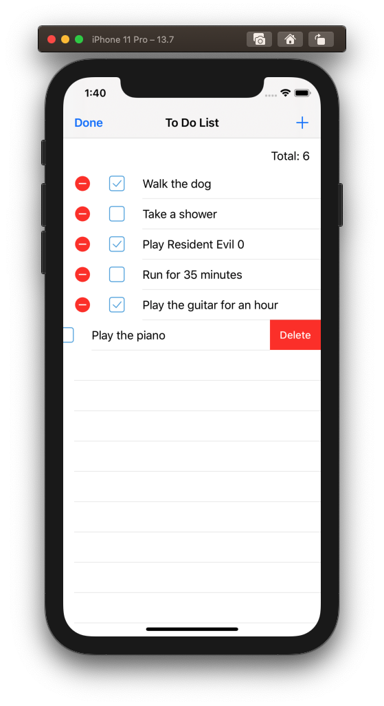
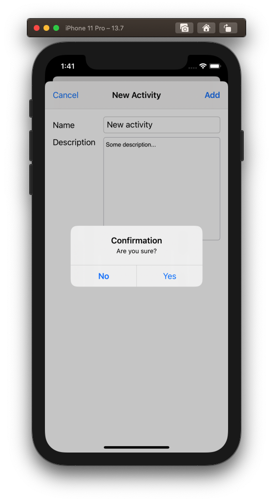
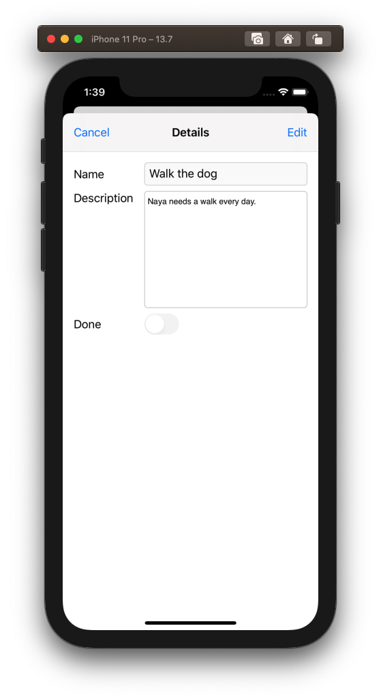
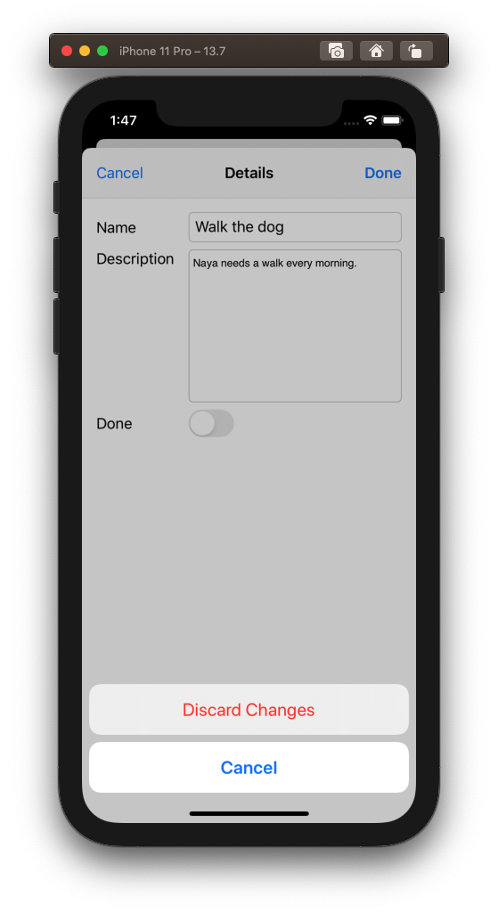
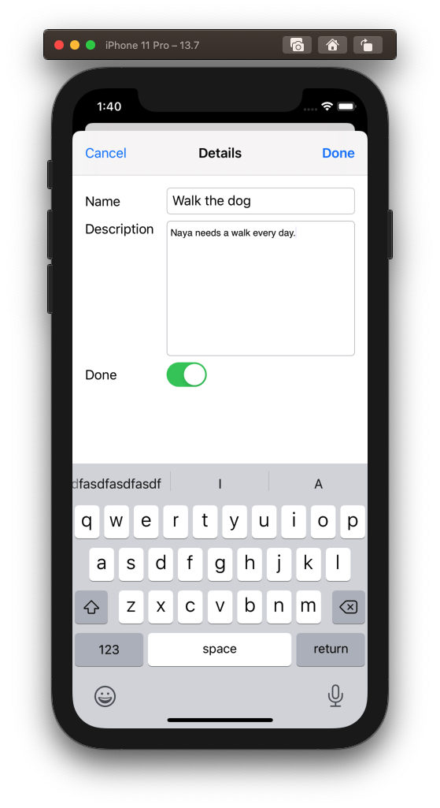
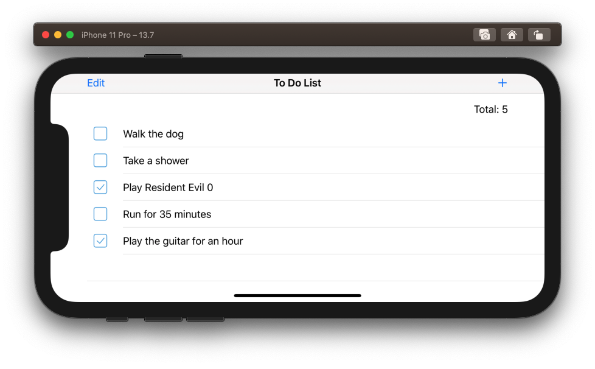
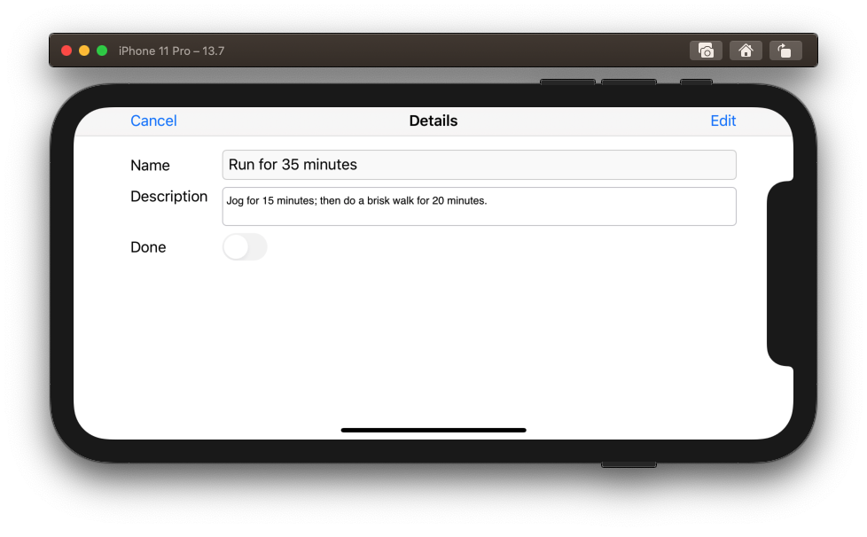

# To Do List
A sample application of the "on-demand" approach to Dependency Injection.

This is a solution to a programming exercise that consists on creating a simple "To Do List" application.
It applies the following technologies and patterns:
* Model View Controller (MVC) architecture
* Dependency Injection / On-Demand approach
* UIKit
* iOS 13 and later

## Screenshots

