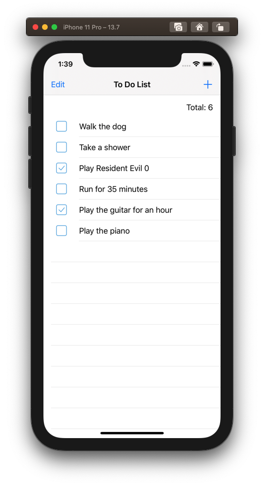
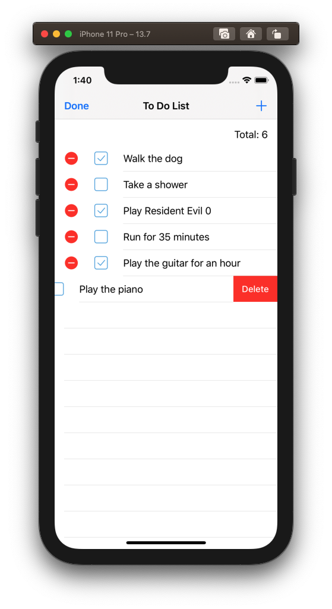
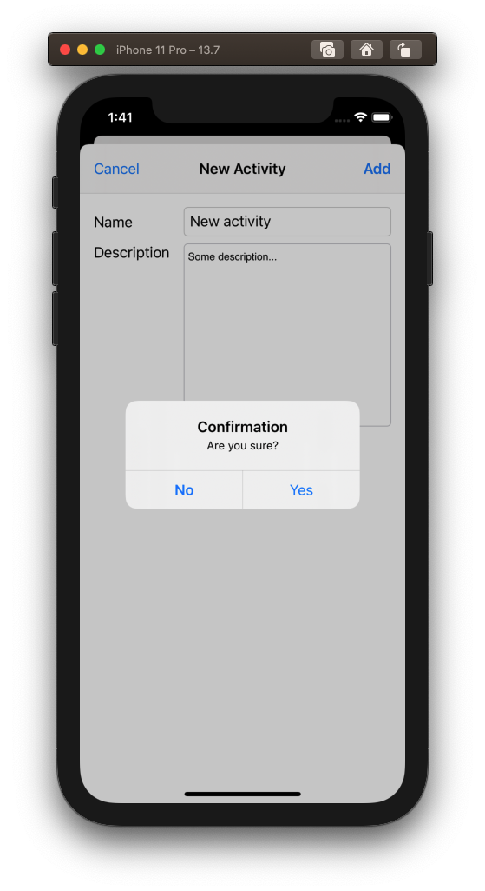
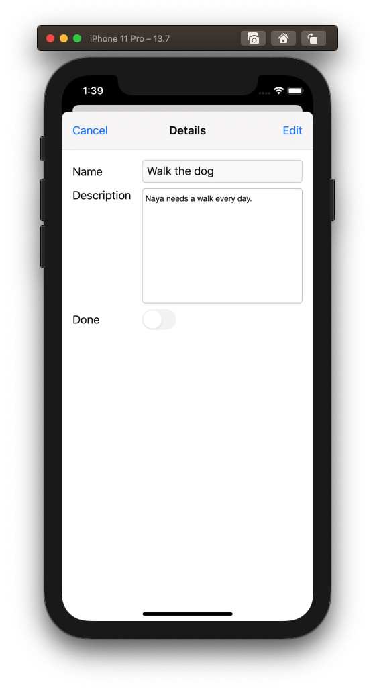
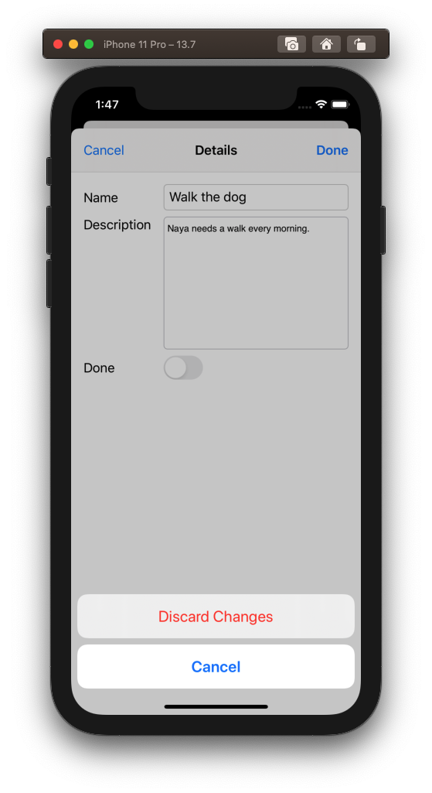
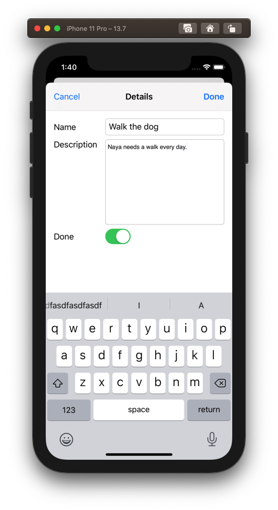
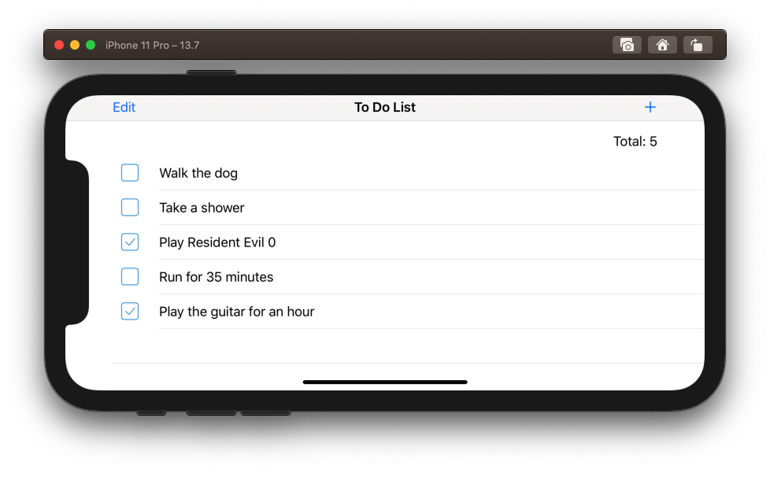
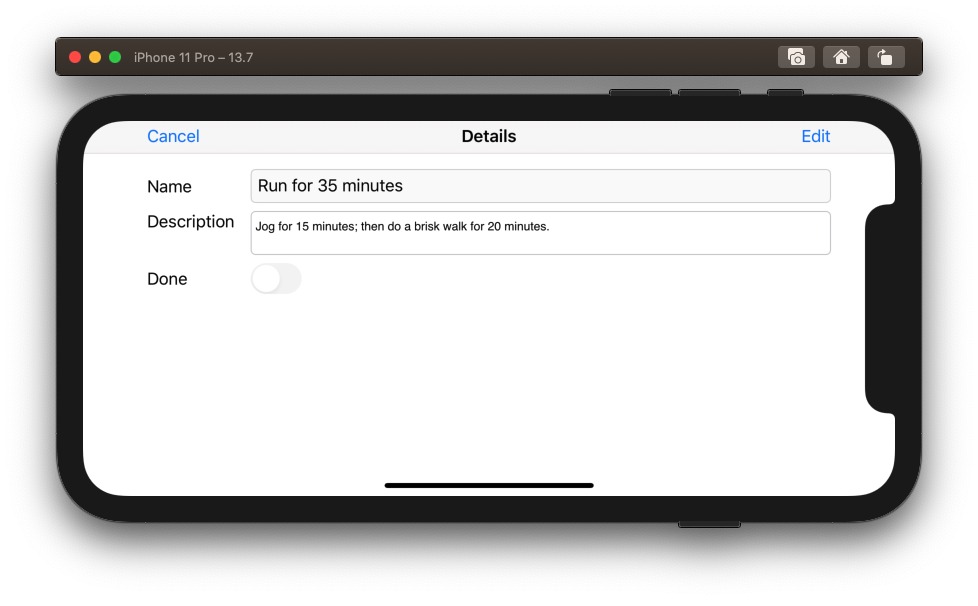

# To Do List (MVC)
A sample application of the Cocoa MVC architecture.

This is a solution to a programming exercise that consists on creating a simple "To Do List" application.
It applies the following technologies and patterns:
* Model View Controller (MVC) architecture
* Dependency Injection / On-Demand approach
* UIKit
* XCTest for integration testing
* iOS 16 and later

## Screenshots

